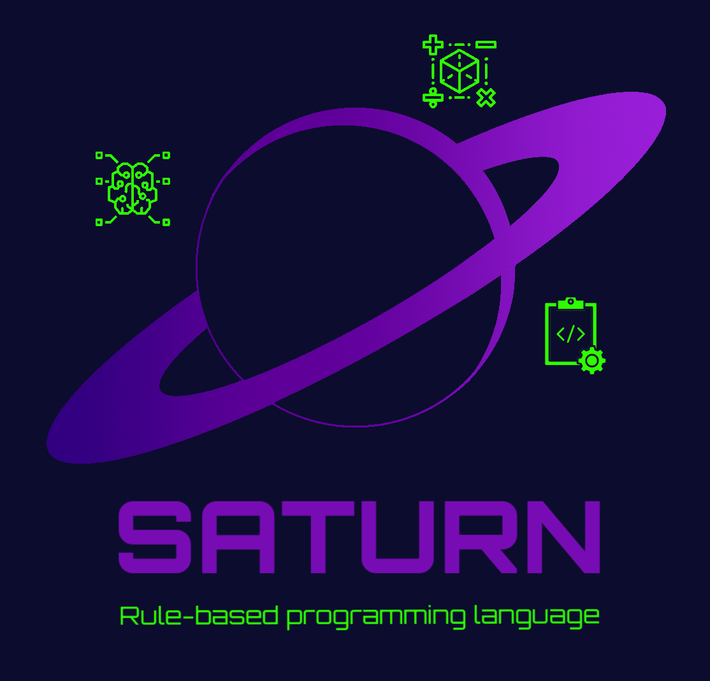

# SATURN
## Язык программирования, основанный на правилах.

Новый (2024) язык программирования, основанный на нормальных алгоритмах Маркова.
В отличие от оригинального исчисления поддерживает типизацию и метапеременные.

### [English version of this README](docs/README_ENGLISH.md)





## Мотивация (Лирическое отступление)
Раздел посвящён вопросу *"а зачем это вот всё? Есть же Pyhon?"*. [Следующий раздел](##Установка).

### Проблема

[Нормальный алгоритм Маркова](https://ru.wikipedia.org/wiki/Нормальный_алгоритм)
(алгорифм Марковаб, НАМ) в своё время стал одним из фундаментальных подходов к
определению понятия алгоритм наряду с [машиной Тьюринга](https://ru.wikipedia.org/wiki/Машина_Тьюринга)
и [лямбда-исчислением](https://ru.wikipedia.org/wiki/Лямбда-исчисление).
Вдохновление спецификой подхода Маркова привело к созданию декларативной парадигмы программирования.
Идея сопоставления выражения с шаблоном стала активно
использоваться также в функциональных ЯП ([Haskell](https://www.haskell.org/tutorial/patterns.html), Scala, F#)
и постепенно пополняет список фич императивных языков
([Java](https://openjdk.org/jeps/406), [Python](https://peps.python.org/pep-0636/))

Однако в оригинальном виде НАМ почти неприменим на практике. Даже для исследовательских
целей он имеет слишком много ограничений. Так, например, чтобы выразить на языке НАМ
тот простой факт, что сложение любого числа с нулём даёт то же самое число, придётся
написать:

```code
0 + 0 -> 1
0 + 1 -> 1
0 + 2 -> 2
0 + 3 -> 3
0 + 4 -> 4
   ...
0 + "a very big number" -> "a very big number"

1 + 0 -> 1
2 + 0 -> 2
3 + 0 -> 3
   ...
```

Расписывать неисчислимое множество однообразных правил, конечно, можно, но любой,
кто хоть более-менее учился в школе знает, что для таких случаем существуют формулы.
Квинтилион строк из примера выше можно кратко записать одной формулой:
`0 + x = x + 0 = x`.

В чистом же НАМ попросту нет переменных. Нет типов. Нет функций, нет ничего кроме
последовательностей символов и правил их преобразования.

### Решение

В связи с возникшей проблемой появилась идея **создать более продвинутое исчисление,
если можно так выразиться, которое бы позволяло использовать переменные
(неизменяемые, как в ФП) и типизацию**. Чтобы заставить это всё работать на реальном
железе нужны транслятор и виртуальная машина. Так появился данный проект.

Также любой ЯП, претендующий на практическую применимость,
должен содержать в себе императивные элементы (чтение файла, к примеру).
С этой целью в язык Saturn в скором времени **будут добавлены** ключевые слова для
вызова процедур, среди которых в том числе исполнение программ на ряде других ЯП.


## Зависимости

* Работа виртульной машины Saturn требует JRE 5.0+ или [JDK 17](https://jdk.java.net/archive/)
* Работа с исходным кодом проекта требует [Scala Cursier](https://docs.scala-lang.org/getting-started/index.html)

## Установка (Linux, MacOS)

#### Весь проект с исходным кодом

1. Установка [Scala Cursier](https://docs.scala-lang.org/getting-started/index.html)

    Для Linux:
    ```shell
    curl -fL https://github.com/coursier/coursier/releases/latest/download/cs-x86_64-pc-linux.gz | gzip -d > cs && chmod +x cs && ./cs setup
    ```
    Для MacOS (x86-64 architecture):
    ```shell
    curl -fL https://github.com/coursier/coursier/releases/latest/download/cs-x86_64-apple-darwin.gz | gzip -d > cs && chmod +x cs && (xattr -d com.apple.quarantine cs || true) && ./cs setup
    ```

2. Клонирование репозитория

    ```shell
    git clone https://github.com/phyalexander/Saturn.git
    ```

3. Переход в директорию Saturn, запуск sbt и вызов команды help-menu для Saturn"

    ```shell
    cd Saturn
    sbt
    run help
    ```


#### Установить только компилятор и виртуальную машину SVM

1. Установка Java Runtime Environment

    Для Archlinux семейства Linux:
    ```shell
    sudo pacman -Sy jre-openjdk
    ```
    Для Debian семейства Linux:
    ```shell
    sudo apt install default-jre
    ```
    Для MacOS:

    [Иструкция по установке](https://www.java.com/ru/download/help/mac_install.html)


2. Клонирование репозитория

    ```shell
    git clone https://github.com/phyalexander/Saturn.git
    ```

3. Переход в дирректорию Saturn и запуск установочного скрипта

    ```shell
    cd Saturn
    сhmod +x install_saturn.sh
    ./install_saturn.sh
    ```
4. Saturn установлен. К нему можно обращаться по имени saturn.sh
    Чтобы вызвать help-menu, используйте `saturn.sh help`. Чтобы исполнить
    программу myprogram.saturn, используйте `saturn.sh run myprogram.saturn`


## Установка (Windows)

1. Открыть браузер
2. Скачать и установить [Linux](https://manjaro.org/products/download/x86)
3. Выполнить установку под Linux


## Docker

Для создания Docker-image можно использовать один из Dockerfile'ов в папке
docker.

#### Только SVM и компилятор

Вариант установки готовых к использованию инструментов Saturn, не требующий
отдельного скачивания и установки Java Runtime Environment на Вашу ОС.
Всё необходимое - уже в контейнере, который нужно лишь собрать. Для этого
выполните действия:

1. Клонирование репозитория

    ```shell
    git clone https://github.com/phyalexander/Saturn.git
    ```

2. Переход в дирректорию и выбор нужного Dockerfile
    ```shell
    cd Saturn
    cp docker/svm_only/Dockerfile ./Dockerfile
    ```

3. Сборка образа
    ```shell
    docker build -t saturn .
    ```
4. Выход из дирректории и удаление лишних файлов
    ```shell
    cd ..
    rm -rf Saturn
    ```

Примеры использования собранного образа
```shell
docker run -v "$PWD":$PWD --rm saturn run $PWD/code.saturn
docker run -v "$PWD":$PWD --rm saturn help
```

#### Образ с исходным кодом проекта под управлением sbt

В данном случае docker выступает в роли виртуальной машины
с Linux внутри. Предполагаемый способ работы - через внутренний
терминал образа.

1. Клонирование репозитория

    ```shell
    git clone https://github.com/phyalexander/Saturn.git
    ```

2. Переход в дирректорию и выбор нужного Dockerfile
    ```shell
    cd Saturn
    cp docker/sbt/Dockerfile ./Dockerfile
    ```

3. Сборка образа
    ```shell
    docker build -t saturn .
    ```
4. Выход из дирректории и удаление лишних файлов
    ```shell
    cd ..
    rm -rf Saturn
    ```

Пример использования собранного образа
```shell
docker run -it saturn
```


## Подсветка синтаксиса в редакторе Pulsar

При помощи пакетного менеджера Pulsar можно установить пакет
[language-saturn](https://github.com/phyalexander/language-saturn.git).


## Что доступно в текущей версии Saturn и будет доступно в последующих

|                      фича                          |  наличие   |
|----------------------------------------------------|------------|
| Создание правил, с указанием переменных и их типов |      +     |
| Создание новых типов                               |      +     |
| Импорт других файлов (модулей)                     |      +     |
| Встроенный механизм обновления Saturn              |      +     |
| Запуск сторонних программ на Python, scala и т д   |      -     |
| Чтение из файла и запись в файл                    |      -     |
| Стандартная библиотека  (std)*                     |      -     |
| Режим REPL                                         |      +     |
| Конструктор типа                                   |      -     |
| Rust-engine (SVM implemented in Rust)              |      -     |

\* <i>Находится в разработке, доступна лишь часть функционала</i>

## Синтаксис языка

Язык Saturn обладает весьма лаконичным синтаксисом. Основным разделителем
выступает символ пробела. Для наследования и задания типа переменной применяется
символ `:`. Используемые ключевые слова: `type`, `import` и `task:`. Прочерк `_`
означает отсутствие элементов, а `--` - начало комментария


#### Комментарии

`<some expression in Saturn> -- <commentary part>`

#### Объявление нового типа

Для задания нового типа нужно
* либо перечислить значения, которые этому типу
соответствуют (говорят "значения населяют тип"),
* либо перечислить типы, объединением
которых создаваемый тип является,
* либо перечислить и то и другое, разделяя одну часть от другой при помощи ` : `

`type <NewTypeName> = <Value 1> <Value 2> : <ParentType 1> <ParentType 2>`

**Примеры**

```
-- тип друзья, включает в себя только значения John, Mark и Eva
type Friends = John Mark Eva

type Parents = mom dad -- Родители - это мама и папа
type Children = son daughter -- Дети - это сын и дочь
type Family = _ : Parents Children -- Семья - это родители и дети

-- 16-ричная система счисления это 10-ричная с добавлением "цифр" A, B, ..., F
type Hex = A B C D E F : Dec
```

**ВАЖНО:**
Пробелы вокруг `=` необходимая часть синтаксиса языка, их нельзя пропускать.
Аналогично нельзя опускать пробелы вокруг `:`.


#### Объявление простого правила

Простое правило - это обычное "Марковское" правило, говорящее виртуальной машине,
что нужно одно выражение заменить другим.

`<Expression1> -> <Expression2>`

**Примеры**

`cats and dogs -> mice and rats`


#### Объявление типизированного правила (правила-шаблона)

Чтобы задать типизированное правило с использованием переменных, нужно
перечилить переменные, используемые в правиле, указывая их типы, и
на следующей строке объявить пару выражений: слева от стрелки что заменить,
справа - на что заменить.

```
<Variable 1> : <Type 1> <Type 2>, <Variable 2> : <Type 3>
<Expression with variables 1> -> <Expression with variables 2>
```

**Примеры**

```
x : Int
x + 0 -> x -- прибавление с нуля

X: Number Vector, Y: Number Vector, Z: Number Vector
X + (Y + Z) -> X + Y + Z
```

**ВАЖНО:**
Пробел после `,` необходимая часть синтаксиса языка, его нельзя пропускать.


#### Сокращённая форма объявления типизированного правила

Часто бывает удобнее записывать правила не в две, а в одну строку.

```
0 + X: Int -> X
```

**ВАЖНО:**
Сокращённая форма имеет ограничение по сравнению с полной: типизируя
переменную, можно задавать лишь один тип.


#### Объявление задачи

Задача - это любое выражение, которое, применяя правила должна преобразовать
виртуальная машина. Задач может быть как одна так и несколько. В импортируемых
модулях можно также указывать задачи - в таком случае они будет исполняться,
так же как и в основном файле.

`task: <Expression>`

**Примеры**

```
task: (3 + 1) * 2
task: John wanted to buy a new pair of socks.
```


#### Экранирование

Временами может возникнуть проблема, связанная с тем, что одно из значений,
населяющих тип является двоеточием или же нижним подчеркиванием, а эти
символы пересекаются с синтаксисом Saturn. Выходом из этой ситуации является
экранирование символов обратным слэшем.

**Примеры**

```
type BackSlash = \_
type Operator = + - * \: & | : BackSlash
type SomeMath = _ : Digit Operator
```

В выражениях левой и правой частей правил экранировать
двоеточие и нижнее подчеркивание ненужно. Но аналогичным образом
можно экранировать символ стрелки:

`X: Bool \-> Y: Bool -> not X and Y`


#### Договорённости об обозначениях

* Имена типов лучше начинать с заглавных букв.
* Имена переменных лучше целиком писать заглавными буквами, чтобы легко выявлять
в выражении.
* Не смотря на то, что от порядка строк в файле исполнение программы не зависит,
лучше импорты модулей размещать в самом верху, далее правила, а в конце - задачи.


## Поддержка
Если у вас возникли сложности или вопросы по использованию Saturn, создайте
[обсуждение](https://github.com/phyalexander/Saturn/issues/new/choose) в данном репозитории.


## Сравнение с аналогами

Данная попытка воплотить НАМ в языке программирования - далеко не первая.
Ниже рассмотрены альтернативы. Сразу стоит обговорить, что эти альтернативы - не
лучше и не хуже Saturn. Глупо сравнивать инструменты решающие разные задачи.
Задача поставленная перед Saturn - быть некой доработкой НАМ, использующей
типизацию и работающей в железе, но при этом максимально близкой именно оригинальной
концепции.

#### [Thue](https://ru.wikipedia.org/wiki/Thue)
Экзотический язык программирования Джона Колагойи почти никак не расширяет фунционал
НАМ: в нём нет переменных и типов. Правила применяются не к подстрокам, а лишь к
отдельным символам. В разделе [Синтаксис](##Синтаксис языка) было показано, что
Saturn напротив поддерживает работу переменными и типами.

#### [MarkovJunior](https://github.com/mxgmn/MarkovJunior)
Этот вероятностный язык программирования, в котором программы являются сочетаниями
правил перезаписи, скорее подходит для написания конечных автоматов
по типу [игры "жизнь""](https://ru.wikipedia.org/wiki/Игра_«Жизнь»). Снова нет
типов, переменных, но есть визуализатор выполнения программы.

#### [Haskell](https://www.haskell.org/)
Функциональный язык программирования с мощным компилятором. Его идеи
и приемы легли в основу многих других ЯП. Почему Haskell попал в этот список?
Язык активно использует сопоставление с шаблоном, носит явно неимперативных
характер. В Haskell функция - это по сути такое правило замены выражения
её вызова на результат её выполнения.

Однако любая программа на Haskell - это набор именованных функций,
которые по имении вызывают друг друга. Цепочки вызовов, прописываемые программистом
задают порядок выполнения программы.

Отличие Saturn от Haskell в том, что в нём, так же как и в НАМ порядка
выполнения нет. Правила можно применять в каком угодно порядке.
И нет имен для правил (функций). Ко всему прочему, Haskell ограничивает возможность
работы с произвольными выражениями.

#### [Рефал](https://ru.wikipedia.org/wiki/Рефал)
Когда заходит речь о реализации алгоритмов Маркова в ЯП, нельзя не упомянуть
Рефал - один из старейших функциональных языков программирования, ориентированный
на символьные вычисления. Однако слово "функциональных" здесь ключевое.
Программы на данном ЯП состоят из функций, которые вызываются по имени. Это делает
его более близким родственником Haskell, чем НАМ.


## Принципы работы

### Сборщик

Главный файл программы поступает на вход сборщику, который, основываясь
на вызовах `import` находит и объединяет все модули программы в единый текст.

### Транслятор

Далее текст программы поступает на вход транслятору, который преобразует его
в структуру состояющую из набора задач, набора правил и набора типов, которые
рекурсивно ссылаются друг на друга. Этот процесс с трудом можно назвать компиляцией,
так как получаемая структура находится в оперативной памяти.

### Виртуальная машина SVM

Получившаяся структура передается на обработку виртуальной машине
(Saturn Virtual Machine, SVM). Та пытается поочереди применить каждое известное
ей правило к полученным задачам до тех пор, пока дальнейшее применение
правил не перестанет быть возможным, и выдает результат.


### Применение правил

В случае НАМ можно было просто посимвольно сопоставить левую часть правила с подстрокой
задачи и затем заменить эту подстроку на другую.

```ruby
Rule = Struct.new(:left, :right) do
    def apply(str)
        str.gsub(left, right)
    end
end
```

Однако в случае типизированного правила так просто поступить не получится. Идея
заключается в том, чтобы сначала сопоставить подстроку задачи с "структурным шаблоном"
левой части правила. Структурный шаблон игнорирует типы переменных (так как если бы
все они были типа Any), предоставляя информацию лишь о взаиморасположении
элементов выражения; показывает распложение переменных относительно статичных
частей выражения.

Под капотом это выглядит так:

Пусть `sum(X: Int, Y: Int) -> X + Y` - какое-то правило. Тогда структурный шаблон
```ruby
template = /sum\((\S+), (\S+)\)/
puts template.match?("sum(3, egg)") # true
```

А вот уже дальше, если в задаче найдена подстрока, удовлетворяющая структурному
шаблону левой части правила, идёт извлечение частей подстроки, стоящих на месте
переменных и проверка на принадлежность соответствующим типам.

```ruby
m = template.match("sum(3, egg)")
puts (m[1] in int_type) # true, 3 is Int
puts (m[2] in int_type) # false, egg is not Int
```

Если подстрока прошла и такую проверку на соответствие, то извлечённые значения
переменных подставляются в правую часть правила, которая в свою очередь
подставляется вместо найденной подстроки в задачу.


### Проверка принадлежности к типу

В силу того, что объекты типов рекурсивно ссылаются друг на друга, образуя дерево,
процесс проверки принадлежности значения к типу носит также рекурсивный характер.
Сначала значение ищется в списке значений, перечисленных в типе. Если оно там
не найдено, то действие повторяется для всех предков данного типа.
Если и там не удалось найти совпадений, то возвращается результат false.

Такой подход позволяет с одной стороны реализовать быстрый поик, а с другой -
экономию памяти.
